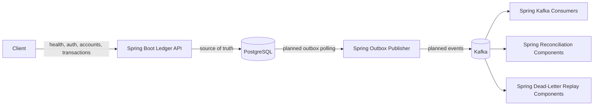
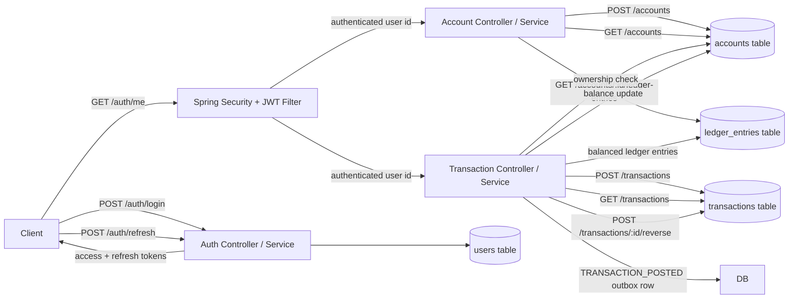

# LedgerFlow

LedgerFlow is a production-inspired transaction processing and reconciliation platform built as a Spring Boot backend systems project.

The project uses:

- Spring Boot for the API layer, transactional ledger logic, outbox publishing, Kafka consumers, and reconciliation
- PostgreSQL as the source of truth
- Kafka for event-driven processing
- Docker Compose for local infrastructure
- Testcontainers for future integration tests

## Goals

LedgerFlow is designed to demonstrate:

- JWT authentication and role-based authorization
- Double-entry ledger accounting
- Idempotent transaction submission
- Optimistic concurrency control
- Transactional outbox publishing
- Retry-safe Kafka consumers
- Dead-letter recovery
- Reconciliation and auditability

## Architecture

```text
Client
  |
  v
Spring Boot Ledger API Service
  |
  v
PostgreSQL
  |
  v
Spring Outbox Publisher
  |
  v
Kafka
  |
  +--> Spring Kafka Consumers
  +--> Spring Reconciliation Components
  +--> Spring Dead-Letter Replay Components
```

## System Flow



Implemented request slices:



Detailed implementation notes live in:

- [Authentication](docs/authentication.md)
- [Accounts](docs/accounts.md)
- [Transactions](docs/transactions.md)

## Repository Structure

```text
ledgerflow/
  services/
    ledger-api/
      src/
        main/
          java/
            com/
              fanryan/
                ledgerflow/
          resources/
            db/
              migration/
        test/
          java/
            com/
              fanryan/
                ledgerflow/
      build.gradle

  shared/
    schemas/

  infrastructure/
    docker/
    kafka/

  scripts/
  loadtests/
  docs/

  docker-compose.yml
  README.md
  .gitignore
```

## Current Status

Current stage: **Milestone 2 - Failure Handling, Concurrency, and Reversals**

Implemented:

- Repository structure
- Docker Compose infrastructure
- Spring Boot API skeleton
- `/health` endpoint
- PostgreSQL connection
- Flyway migration setup
- `users` table migration
- Seed admin user migration
- Spring Security baseline
- `/auth/login` endpoint
- `/auth/refresh` endpoint
- Auth error handling for invalid credentials
- Auth error handling for invalid refresh tokens
- BCrypt password verification
- JWT access token generation
- JWT refresh token generation
- JWT validation filter
- `/auth/me` authenticated endpoint
- Auth flow tests for login, refresh, invalid credentials, invalid tokens, and `/auth/me`
- `accounts` table migration
- `POST /accounts` authenticated account creation endpoint
- `GET /accounts` authenticated account listing endpoint
- `GET /accounts/{accountId}/ledger-entries` authenticated account ledger listing endpoint
- Account ownership derived from JWT subject, not request body
- Account request validation with clean `400` errors
- Account flow tests for protected access, creation, listing, invalid currency, currency normalization, and ledger entry listing
- `transactions` table migration
- `idempotency_keys` table migration
- `ledger_entries` table migration
- `POST /transactions` authenticated transaction submission endpoint
- `GET /transactions` authenticated transaction listing endpoint
- `POST /transactions/{transactionId}/reverse` authenticated reversal endpoint
- Idempotency lookup through `Idempotency-Key`, request hash, and stored response metadata
- Duplicate idempotency key with a different payload returns `409`
- Account ownership check before transaction creation
- Transaction request validation with clean errors
- Transaction flow tests for auth, successful submission, idempotency replay, idempotency conflict, invalid amount, and currency mismatch
- Transaction posting updates account balances
- Successful transactions return `POSTED`
- Deposit and withdrawal create balanced ledger entries
- Frozen and closed accounts cannot submit transactions
- USD settlement system account is seeded for offset entries
- Insufficient funds returns `422`
- Insufficient funds records a `FAILED` transaction row
- Idempotent retries do not update balances twice
- Transaction reversal creates an offsetting transaction and balanced ledger entries
- Reversal requests require an idempotency key and reason
- Reversal idempotent retries return the original reversal result
- Reusing a reversal idempotency key with a different payload returns `409`
- Optimistic locking conflicts return `409 CONCURRENT_TRANSACTION_CONFLICT`
- Concurrent withdrawal tests prove the account cannot be overdrawn by racing requests
- `outbox_events` table migration
- Posted transactions and reversals write `TRANSACTION_POSTED` outbox rows in the same database transaction
- Outbox payloads are stored as PostgreSQL `jsonb`
- Outbox event creation test verifies a posted transaction creates a pending outbox event

Next: claim-based outbox publisher and Kafka publishing.

## Local Development

Start local infrastructure:

```bash
docker compose up -d
```

Stop local infrastructure:

```bash
docker compose down
```

Delete local infrastructure volumes:

```bash
docker compose down -v
```

Run the API:

```bash
cd services/ledger-api
gradle bootRun
```

Check health:

```bash
curl http://localhost:8080/health
```

Log in as the local admin user:

```bash
curl -X POST http://localhost:8080/auth/login \
  -H "Content-Type: application/json" \
  -d '{"email":"admin@ledgerflow.local","password":"password"}'
```

Check the current authenticated user:

```bash
curl http://localhost:8080/auth/me \
  -H "Authorization: Bearer <access_token>"
```

Refresh tokens:

```bash
curl -X POST http://localhost:8080/auth/refresh \
  -H "Content-Type: application/json" \
  -d '{"refreshToken":"<refresh_token>"}'
```

Create an account:

```bash
curl -X POST http://localhost:8080/accounts \
  -H "Content-Type: application/json" \
  -H "Authorization: Bearer <access_token>" \
  -d '{"currency":"USD"}'
```

List accounts:

```bash
curl http://localhost:8080/accounts \
  -H "Authorization: Bearer <access_token>"
```

List account ledger entries:

```bash
curl http://localhost:8080/accounts/<account_id>/ledger-entries \
  -H "Authorization: Bearer <access_token>"
```

Submit a transaction:

```bash
curl -X POST http://localhost:8080/transactions \
  -H "Content-Type: application/json" \
  -H "Authorization: Bearer <access_token>" \
  -H "Idempotency-Key: tx-example-001" \
  -d '{
    "accountId": "<account_id>",
    "type": "DEPOSIT",
    "amountMinor": 1000,
    "currency": "USD",
    "description": "Example deposit"
  }'
```

List transactions:

```bash
curl http://localhost:8080/transactions \
  -H "Authorization: Bearer <access_token>"
```

Reverse a transaction:

```bash
curl -X POST http://localhost:8080/transactions/<transaction_id>/reverse \
  -H "Content-Type: application/json" \
  -H "Authorization: Bearer <access_token>" \
  -H "Idempotency-Key: reverse-example-001" \
  -d '{
    "reason": "Customer requested reversal"
  }'
```

Run tests:

```bash
cd services/ledger-api
gradle test
```

## Milestones

### Milestone 1

- Spring Boot API
- JWT authentication
- Account creation
- Account listing
- Double-entry ledger posting for deposits and withdrawals
- Basic transaction state machine with `PENDING` and `POSTED`

### Milestone 2

- Transaction `FAILED` status on insufficient funds
- Account-state transaction guards for frozen and closed accounts
- Reversal support with compensating ledger entries
- Idempotent reversal retries
- Optimistic concurrency conflict handling
- Concurrent transaction tests

### Milestone 3

- Transactional outbox table and schema
- Outbox event writes inside transaction posting/reversal workflows
- Claim-based outbox publisher
- Kafka publishing with retry and dead-letter routing

### Milestone 4

- Spring Boot Kafka consumers
- PayFlow consumer for `payment.captured` and `payment.settled`
- Reconciliation jobs with structured report output
- Scheduled reconciliation
- Dead-letter replay tooling

### Milestone 5

- Balance snapshot mechanism
- Integration tests via Testcontainers
- Benchmarks
- Architecture documentation
