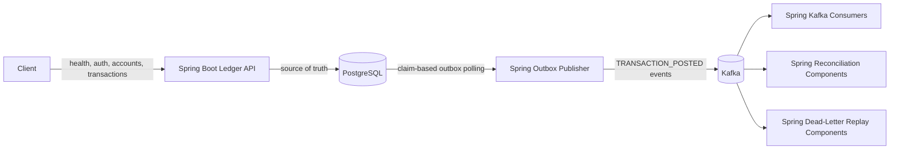
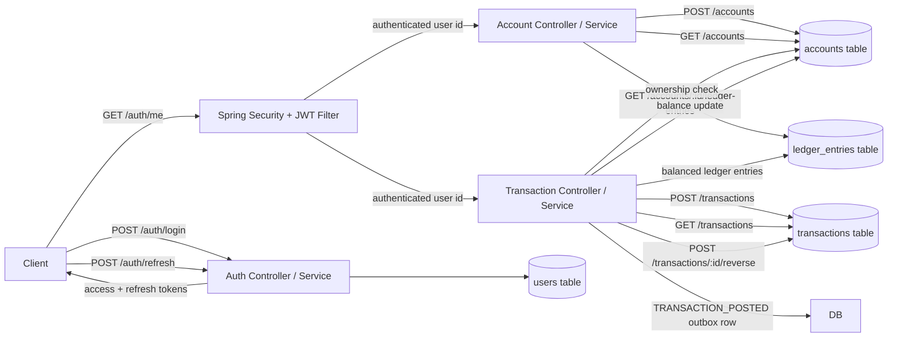

# LedgerFlow

LedgerFlow is a production-inspired transaction processing and reconciliation platform built as a Spring Boot backend systems project.

The project uses:

- Spring Boot for the API layer, transactional ledger logic, outbox publishing, Kafka consumers, and reconciliation
- PostgreSQL as the source of truth
- Kafka for event-driven processing
- Docker Compose for local infrastructure
- Testcontainers for PostgreSQL and Kafka integration tests

## Goals

LedgerFlow is designed to demonstrate:

- JWT authentication and role-based authorization
- Double-entry ledger accounting
- Idempotent transaction submission
- Optimistic concurrency control
- Transactional outbox publishing
- Retry-safe Kafka consumers
- Dead-letter recovery
- Reconciliation and auditability

## Architecture

```text
Client
  |
  v
Spring Boot Ledger API Service
  |
  v
PostgreSQL
  |
  v
Spring Outbox Publisher
  |
  v
Kafka
  |
  +--> Spring Kafka Consumers
  +--> Spring Reconciliation Components
  +--> Spring Dead-Letter Replay Components
```

## System Flow



Implemented request slices:



Detailed implementation notes live in:

- [Authentication](docs/authentication.md)
- [Accounts](docs/accounts.md)
- [Transactions](docs/transactions.md)
- [PayCore Integration](docs/paycore-integration.md)
- [Reconciliation](docs/reconciliation.md)
- [Dead-Letter Replay](docs/dead-letter-replay.md)
- [Testing](docs/testing.md)
- [Architecture Tradeoffs](docs/architecture-tradeoffs.md)

## Repository Structure

```text
ledgerflow/
  services/
    ledger-api/
      src/
        main/
          java/
            com/
              fanryan/
                ledgerflow/
          resources/
            db/
              migration/
        test/
          java/
            com/
              fanryan/
                ledgerflow/
      build.gradle

  docs/

  docker-compose.yml
  README.md
  .gitignore
```

## Implemented Features

- Authenticated Spring Boot API with JWT login, refresh, and current-user lookup.
- Account APIs with ownership derived from the JWT subject.
- Transaction APIs with idempotency, double-entry ledger posting, reversals, insufficient-funds handling, and optimistic concurrency protection.
- Transactional outbox with claim-based publishing to Kafka.
- Kafka consumption for internal ledger events with idempotent consumed-event auditing.
- PayCore event ingestion for `payment.captured` and `payment.settled`, using PayCore `eventId` as the transaction idempotency key.
- Ledger and account-balance reconciliation with persisted report summaries.
- Dead-letter persistence and authenticated replay for failed PayCore events.
- Focused unit, flow, and Testcontainers integration tests across auth, accounts, transactions, outbox, Kafka consumers, reconciliation, and dead-letter replay.

## Local Development

Start local infrastructure:

```bash
docker compose up -d
```

Stop local infrastructure:

```bash
docker compose down
```

Delete local infrastructure volumes:

```bash
docker compose down -v
```

Run the API:

```bash
cd services/ledger-api
gradle bootRun
```

Check health:

```bash
curl http://localhost:8080/health
```

Log in as the local admin user:

```bash
curl -X POST http://localhost:8080/auth/login \
  -H "Content-Type: application/json" \
  -d '{"email":"admin@ledgerflow.local","password":"password"}'
```

Check the current authenticated user:

```bash
curl http://localhost:8080/auth/me \
  -H "Authorization: Bearer <access_token>"
```

Refresh tokens:

```bash
curl -X POST http://localhost:8080/auth/refresh \
  -H "Content-Type: application/json" \
  -d '{"refreshToken":"<refresh_token>"}'
```

Create an account:

```bash
curl -X POST http://localhost:8080/accounts \
  -H "Content-Type: application/json" \
  -H "Authorization: Bearer <access_token>" \
  -d '{"currency":"USD"}'
```

List accounts:

```bash
curl http://localhost:8080/accounts \
  -H "Authorization: Bearer <access_token>"
```

List account ledger entries:

```bash
curl http://localhost:8080/accounts/<account_id>/ledger-entries \
  -H "Authorization: Bearer <access_token>"
```

Submit a transaction:

```bash
curl -X POST http://localhost:8080/transactions \
  -H "Content-Type: application/json" \
  -H "Authorization: Bearer <access_token>" \
  -H "Idempotency-Key: tx-example-001" \
  -d '{
    "accountId": "<account_id>",
    "type": "DEPOSIT",
    "amountMinor": 1000,
    "currency": "USD",
    "description": "Example deposit"
  }'
```

List transactions:

```bash
curl http://localhost:8080/transactions \
  -H "Authorization: Bearer <access_token>"
```

Reverse a transaction:

```bash
curl -X POST http://localhost:8080/transactions/<transaction_id>/reverse \
  -H "Content-Type: application/json" \
  -H "Authorization: Bearer <access_token>" \
  -H "Idempotency-Key: reverse-example-001" \
  -d '{
    "reason": "Customer requested reversal"
  }'
```

Run tests:

```bash
cd services/ledger-api
gradle test
```

## Milestones

### Milestone 1

- Spring Boot API
- JWT authentication
- Account creation
- Account listing
- Double-entry ledger posting for deposits and withdrawals
- Basic transaction state machine with `PENDING` and `POSTED`

### Milestone 2

- Transaction `FAILED` status on insufficient funds
- Account-state transaction guards for frozen and closed accounts
- Reversal support with compensating ledger entries
- Idempotent reversal retries
- Optimistic concurrency conflict handling
- Concurrent transaction tests

### Milestone 3

- Transactional outbox table and schema
- Outbox event writes inside transaction posting/reversal workflows
- Claim-based outbox publisher
- Kafka publishing with retry metadata
- Outbox publisher tests

### Milestone 4

- Spring Boot Kafka consumer foundation
- PayCore consumer for `payment.captured` and `payment.settled`
- Consumed event audit table
- Ledger balance reconciliation report
- Dead-letter routing and replay
- Dead-letter replay tooling
- Richer reconciliation detail payloads
- Scheduled reconciliation

### Milestone 5

- Balance snapshot mechanism
- Broader integration tests via Testcontainers
- Benchmarks
- Architecture documentation
