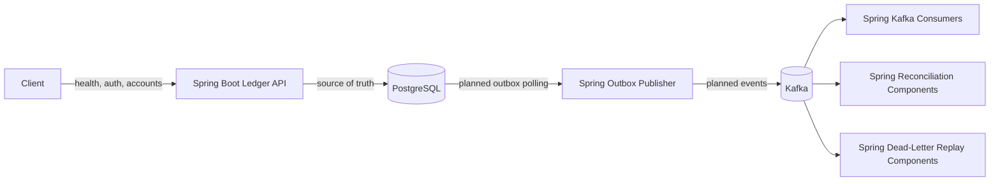
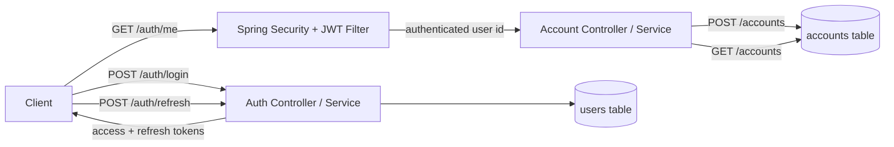

# LedgerFlow

LedgerFlow is a production-inspired transaction processing and reconciliation platform built as a Spring Boot backend systems project.

The project uses:

- Spring Boot for the API layer, transactional ledger logic, outbox publishing, Kafka consumers, and reconciliation
- PostgreSQL as the source of truth
- Kafka for event-driven processing
- Docker Compose for local infrastructure
- Testcontainers for future integration tests

## Goals

LedgerFlow is designed to demonstrate:

- JWT authentication and role-based authorization
- Double-entry ledger accounting
- Idempotent transaction submission
- Optimistic concurrency control
- Transactional outbox publishing
- Retry-safe Kafka consumers
- Dead-letter recovery
- Reconciliation and auditability

## Architecture

```text
Client
  |
  v
Spring Boot Ledger API Service
  |
  v
PostgreSQL
  |
  v
Spring Outbox Publisher
  |
  v
Kafka
  |
  +--> Spring Kafka Consumers
  +--> Spring Reconciliation Components
  +--> Spring Dead-Letter Replay Components
```

## System Flow



Implemented request slices:



Detailed implementation notes live in:

- [Authentication](docs/authentication.md)
- [Accounts](docs/accounts.md)

## Repository Structure

```text
ledgerflow/
  services/
    ledger-api/
      src/
        main/
          java/
            com/
              fanryan/
                ledgerflow/
          resources/
            db/
              migration/
        test/
          java/
            com/
              fanryan/
                ledgerflow/
      build.gradle

  shared/
    schemas/

  infrastructure/
    docker/
    kafka/

  scripts/
  loadtests/
  docs/

  docker-compose.yml
  README.md
  .gitignore
```

## Current Status

Current stage: **Milestone 1 - API, Authentication, and Account Foundation**

Implemented:

- Repository structure
- Docker Compose infrastructure
- Spring Boot API skeleton
- `/health` endpoint
- PostgreSQL connection
- Flyway migration setup
- `users` table migration
- Seed admin user migration
- Spring Security baseline
- `/auth/login` endpoint
- `/auth/refresh` endpoint
- Auth error handling for invalid credentials
- Auth error handling for invalid refresh tokens
- BCrypt password verification
- JWT access token generation
- JWT refresh token generation
- JWT validation filter
- `/auth/me` authenticated endpoint
- Auth flow tests for login, refresh, invalid credentials, invalid tokens, and `/auth/me`
- `accounts` table migration
- `POST /accounts` authenticated account creation endpoint
- `GET /accounts` authenticated account listing endpoint
- Account ownership derived from JWT subject, not request body
- Account request validation with clean `400` errors
- Account flow tests for protected access, creation, listing, invalid currency, and currency normalization

Next:

- Transaction table migration
- Ledger entry table migration
- Transaction posting API

## Local Development

Start local infrastructure:

```bash
docker compose up -d
```

Stop local infrastructure:

```bash
docker compose down
```

Delete local infrastructure volumes:

```bash
docker compose down -v
```

Run the API:

```bash
cd services/ledger-api
gradle bootRun
```

Check health:

```bash
curl http://localhost:8080/health
```

Log in as the local admin user:

```bash
curl -X POST http://localhost:8080/auth/login \
  -H "Content-Type: application/json" \
  -d '{"email":"admin@ledgerflow.local","password":"password"}'
```

Check the current authenticated user:

```bash
curl http://localhost:8080/auth/me \
  -H "Authorization: Bearer <access_token>"
```

Refresh tokens:

```bash
curl -X POST http://localhost:8080/auth/refresh \
  -H "Content-Type: application/json" \
  -d '{"refreshToken":"<refresh_token>"}'
```

Create an account:

```bash
curl -X POST http://localhost:8080/accounts \
  -H "Content-Type: application/json" \
  -H "Authorization: Bearer <access_token>" \
  -d '{"currency":"USD"}'
```

List accounts:

```bash
curl http://localhost:8080/accounts \
  -H "Authorization: Bearer <access_token>"
```

Run tests:

```bash
cd services/ledger-api
gradle test
```

## Milestones

### Milestone 1

- Spring Boot API
- JWT authentication
- Account creation
- Account listing

### Milestone 2

- Transaction posting
- Double-entry ledger

### Milestone 3

- Idempotency
- Optimistic concurrency
- Reversal support
- Concurrent transaction tests

### Milestone 4

- Transactional outbox
- Kafka publishing
- Retry handling
- Dead-letter routing

### Milestone 5

- Integration tests
- Benchmarks
- Observability
- Architecture documentation
